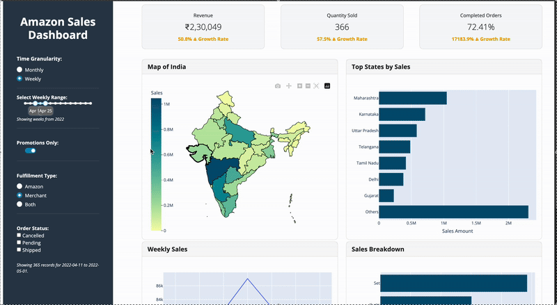

# E-commerce Sales Dashboard

_Empower e-commerce success with actionable insights from your sales data._

[](https://dsci-532-2025-29-e-commerce-dashboard.onrender.com/)

_See our dashboard in action!_



## Welcome!

Welcome to our E-Commerce Sales Dashboard! This project is designed to empower e-commerce clothing store managers with a powerful tool to analyze the sales performance. Built by a data science consultancy firm, this dashboard transforms raw sales data into actionable insights for smarter decision-making.

## Motivation and Purpose

Running an e-commerce clothing store comes with unique challenges: managing a wide variety of product SKUs, keeping up with fast-changing fashion trends, and making sense of massive sales datasets. For store managers, understanding whether sales align with market demand or if adjustments to inventory and marketing are needed can feel overwhelming.

That’s where the E-Commerce Sales Dashboard steps in. Our goal is to simplify data analysis by providing a clear, interactive view of sales performance and regional trends. Whether you're tracking revenue, comparing fulfillment methods, or identifying top-performing regions, this dashboard helps you stay ahead in the competitive world of e-commerce.

## What Can You Do with This Dashboard?

This dashboard is built for e-commerce clothing store managers running online stores in India. With it, you can:

- **Explore Sales Trends**: Visualize how sales fluctuate over time and spot patterns.

- **Compare Regions**: See which states or regions drive the most revenue and pinpoint areas with lower sales.

- **Identify Top Products**: Discover the best-selling products in each region.

- **Analyze Fulfillment**: Compare Amazon Fulfilled vs. Merchant Fulfilled orders to optimize logistics.

- **Understand Promotions**: Assess how discounts impact sales performance.

What are you waiting for? Try our dashboard [here](https://dsci-532-2025-29-e-commerce-dashboard.onrender.com/)!

## Who Is This For?

#### 1. Store Managers Looking to Use the Dashboard
If you’re an e-commerce professional in India, this tool is for you! Whether you’re managing inventory, refining marketing strategies, or negotiating with delivery partners, the dashboard provides a high-level overview of your sales data to support data-driven decisions. No technical expertise required—just dive in and explore!

**Need Help?** If you have questions or run into issues, feel free to [open an issue](https://github.com/UBC-MDS/DSCI-532_2025_29_e-commerce-dashboard/issues) and label it as "help wanted" on this repository. We’re here to assist!

#### 2. Developers and Contributors
Interested in running the dashboard locally or contributing to its development? We’d love your help! This project is built with a passion for data science and e-commerce, and we welcome contributors who want to enhance its features or adapt it for other datasets. Keep reading for setup instructions and contribution details!


## Installation and Running Locally

Want to run the dashboard on your machine? Follow these steps:

#### Setup

1. **Clone the Repository:**

```bash
git clone https://github.com/UBC-MDS/DSCI-532_2025_29_e-commerce-dashboard.git
cd e-commerce-sales-dashboard
```


## Installation

From the root directory of this repo:

1. Create conda environment
```bash
conda env create -n dashboard -f environment.yml
```

2. Activate conda environment
```bash
conda activate dashboard
```

3. Run Dash app
```bash
python src/app.py
```

Navigate to `http://127.0.0.1:8050/` in the browser to see the dashboard. 

## Contributors
Jenson Chang, Shashank Hosahalli Shivamurthy, Sienko Ikhabi, Yajing Liu

## License
Licensed under the terms of the [MIT license](https://github.com/UBC-MDS/DSCI-532_2025_29_e-commerce-dashboard//blob/main/LICENSE).