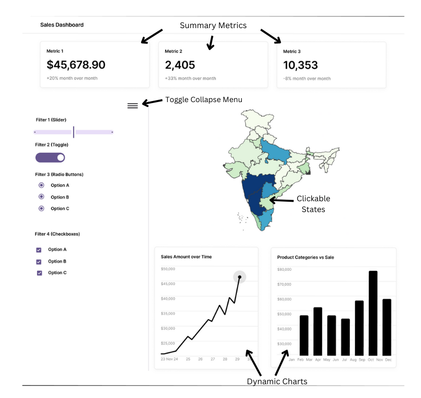

# Milestone 1 - Dashboard proposal

## 1. Motivation and Purpose

**Our role:** Data science consultancy firm

**Target audience:** e-commerce clothing store manager

For e-commerce clothing stores that have a wide variety of product SKUs, it could be difficult to analyze sales performance and market trends due to the volume of data. Fashion trends also change fast so it’s important for a manager to have a dashboard of data to quickly understand whether sales are matching the fashion trends or if marketing strategy/inventory need to be adjusted.

## 2. Description of Data

We will be visualizing a dataset of 128,975 e-commerce sales transactions with 11 selected columns, though we will initially build our dashboard using a random 10% subset (~13,000 records) for development. The dataset contains sales transactions from Amazon India, covering a short period in 2022 ([E-Commerce Sales Dataset](https://www.kaggle.com/datasets/thedevastator/unlock-profits-with-e-commerce-sales-data)). It provides information on sales performance, fulfillment methods, product details, and shipping locations, enableing e-commerce store managers to analyze market trends, optimize inventory, and refine marketing strategies.

The dataset consists of categorical variables (e.g., fulfillment method, order status, product category, shipping location) and numerical variables (e.g., quantity sold, revenue). These variables will help answer key questions such as:

- How do sales fluctuate over time? Tracking revenue trends and identifying seasonal effects.
- Which fulfillment methods lead to more successful sales? Comparing Amazon Fulfilled vs. Merchant Fulfilled orders.
- Where are the top-performing regions? Identifying demand based on shipping locations.
- How do product characteristics impact sales? Analyzing category and size preferences.

To enhance our analysis and visualizations, we will create the following new variables:

1. "Is Promotion" (Boolean) – A derived indicator based on the `promotion-ids` column:

    - `True` if the transaction has a promotion applied.
    - `False` if no promotion is applied.
    - This will help analyze how discounts and promotions affect sales performance.

2. "Sales per Month" (Aggregated Numerical) – Total revenue and quantity sold aggregated by month:

    - Helps visualize monthly sales trends to identify seasonal patterns and peak demand periods.

By incorporating these derived variables, we can generate insights into sales patterns, the impact of promotions, and monthly revenue trends, enabling e-commerce store managers to make data-driven decisions.

## 3. Research Question and Usage Scenario

Amit is an entrepreneur who runs an online clothing store in India. Through his virtual store, he sells clothing items to customers across the country. He wants to [explore] his sales data to [compare] how the volume of sales orders vary by region/state. He would like to [identify] the locations that contribute the most to his revenue and [pinpoint] the regions with lower sales. Amit also wants to [understand] the top products ordered in each of the regions.

Using the "E-Commerce Sales Dashboard" Amit sees an overview of all his sales orders segmented by customer region. He can filter and compare sales trends across different regions to identify the ones have the highest and lowest purchase activity as well as top selling products. As he explores the data, Amit notices that customers from some states tend to place fewer orders. He explores the data further to [analyze] if there is any link between low order rates and delivery time.

Amit makes a guess that perhaps customers in these regions might be discouraged by long delivery time for their orders. However, the system that Amit uses for his storefront does not currently track abandoned shopping carts. He is therefore unable to compare prospective sales with actual sales orders. Amit decides to begin collecting data on abandoned shopping carts so that he can further investigate whether the regions with lower sales might have higher cart abandonment. This will allow Amit to negotiate how to optimize shipping times with his current delivery partners, or add addition service providers who have better coverage in those regions.

## 4. App Sketch and Description

  
   
    Sales Dashboard Sketch

<!--  -->

Our E-Commerce Sales Dashboard is a single-page interactive dashboard designed for entrepreneurs like Amit to analyze sales trends, identify revenue-driving regions, and explore potential factors (via various filters) affecting low sales performance. The dashboard provides an intuitive layout with dynamic visualizations, interactive filters, and a clickable geographic map for state-specific analysis. 

The key features of our dashboard include:

- At the top of the dashboard, three key performance indicators (KPIs) provide an instant overview of business performance. The values dynamically update based on applied filters and user interactions with the dashboard. 
- A collapsible sidebar contains a set of filters that allow Amit to refine his data exploration. Users can collapse or expand the filter panel to maximize dashboard space.
- The core visual element of the dashboard is a dynamic, interactive map of India, which displays sales data at a state level. Clicking on a state dynamically updates the charts and KPIs to show region-specific data.
- Below the map, two interactive charts that dynamically update based on applied filters or selected states on the map provide deeper insights into sales trends:
    - Sales Trend Over Time (Line Chart) – Displays how sales fluctuate across different time periods.
    - Top-Selling Products (Bar Chart) – Highlights the best-performing products in the selected state or region.