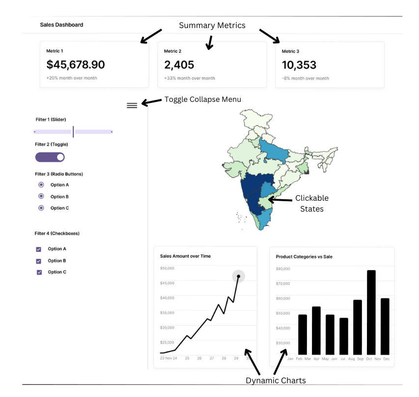

# Milestone 4 Reflection

## Dashboard Sketch ##

## Valuable Insights for Dashboard Development ##
- We particulary found the official documentation of [Dash Core Components](https://dash.plotly.com/dash-core-components) by plotly helpful.
- One piece of peer feedback was especially helpful in [highlighting the need to address data quality issues](https://github.com/UBC-MDS/DSCI-532_2025_29_e-commerce-dashboard/issues/88) and handle scenarios where no data was available.
- Knowing that our instructor, [Joel, was reviewing our work](https://github.com/UBC-MDS/DSCI-532_2025_29_e-commerce-dashboard/issues/16) pushed us to showcase our best efforts. For future cohorts, this approach could be a great motivator for teams to challenge themselves and strive for excellence.

## Implementation since Milestone 3: ##

In this Milestone, we primarily focused on existing issues and feedback from Milestone 3. We also implemented the following features/changes:

#### Major Changes:
- We changed our UI slightly, moving the title to the left of the dashboard and adding colors to the section with the filters.
- The growth rate is now calculated based on [CAGR (Compound Annual Growth Rate)](https://en.wikipedia.org/wiki/Compound_annual_growth_rate) instead of a simple periodic rate (i.e., weekly or monthly growth).
- Color scheme used in the dashboard has been updated to remain consistent throughout.
- Displays explanatory text instead of empty charts when data is missing.

#### Minor Changes/ Fixes:
- Now, when the user hovers a state, they can see that it is clickable.
- Fixed ordering in "Sales by State" to correctly handle selected states, ensuring they aren’t duplicated if already in the top 7. Also changed the title to "Top States by Sales".
- The weekly range filter now shows the start date of the week as a tooltip.
- Capitalized product category names for consistency.

#### Code Changes:
- Switched to parquet format for cleaned data.
- Replaced most `.apply()` with vectorized operations.
- Utilized Flask caching.
- Currently using the full dataset.

## Changes from Dashboard Sketch

- "Collapse Menu" toggle not implemented since there's enough horizontal real estate in the dashboard. 
- Summary metrics now say Growth Rate instead of Periodic Rate.
- Map looks slightly different due to using a different geojson file.
- One additional filter (`Time Granularity`) and visualization (`Top States by Sales`) added to the dashboard.

**Not implemented:**

- "Collapse Menu" toggle

## Known Issues ## 
- Overlapping tooltips when the weekly filter range is small [#124](https://github.com/UBC-MDS/DSCI-532_2025_29_e-commerce-dashboard/issues/124).
- Some of the tooltips on the charts have inconsistent formatting and use North American formatting [#100](https://github.com/UBC-MDS/DSCI-532_2025_29_e-commerce-dashboard/issues/100).

We are aware of these issues but are not able to address them right now due to time constraints. Currently, we've intentionally left these open and tagged as `good first issue` promoting open-source contributions.

## Deviation from Best Practice ##
Not applicable

## Limitations and Future Improvements ##
- Highlighting the sales of the state that's been selected by the user on the bar chart
- A State dropdown list next to the map if the user wants to analyze a specific state and don't know where it is on the map
- Adding multi-select for state on the map.
- Introduce a time slider with predefined ranges (e.g., last 7 days) for quicker filtering.
- Toggle dark/light mode.
